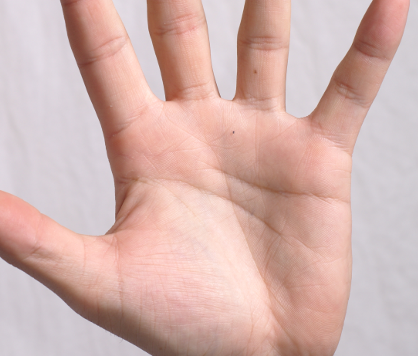
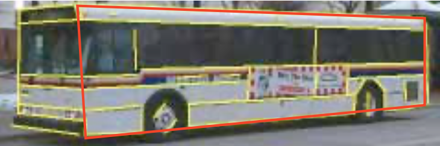
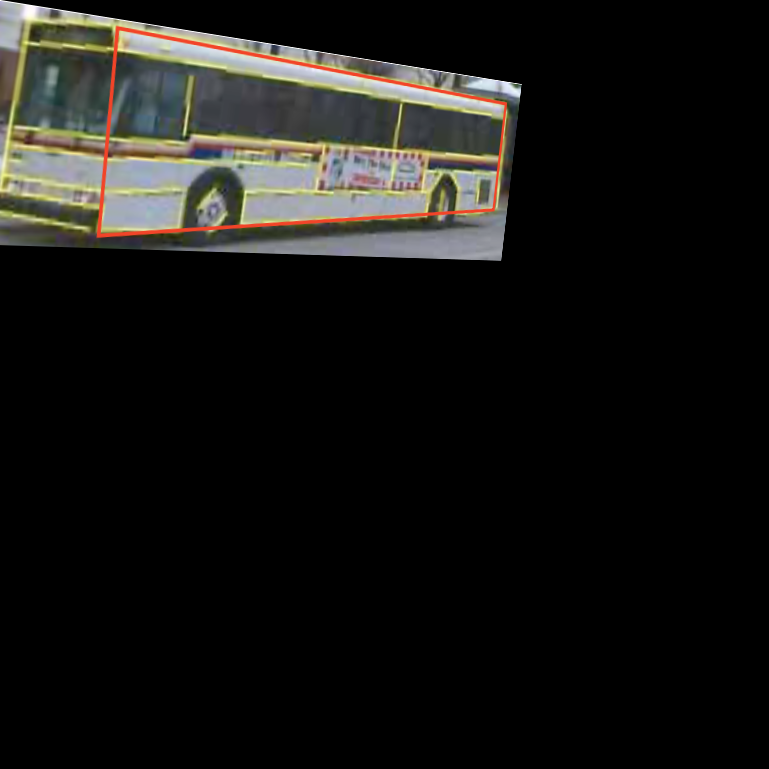

# DIP Homework 1

## Image fusion

### 算法原理与实现

#### Poisson编辑

* 首先根据mask得到想要编辑的部分，以及通过偏移量设置想要在目标图像上填充的位置。

* 通过已知的边界信息（边界像素与target图像一致），以及内部的梯度信息（内部像素梯度与source图像一致）构造线性方程：
    $$
    Ax=b
    $$
    求解得到填充像素，融合进target图像即可。

### 效果展示

Example1

<center>
    
    
    </br>
    </br>
    
    
</center>

Example2

<center>
    
    
    </br>
    </br>
    
    
</center>
### 具体实现

```python
from skimage import io
import numpy as np
from scipy.sparse import linalg
from scipy.sparse import lil_matrix


# loc: (shift in row, shift in col)
def shift(src, tar, mask, loc):
    row = np.shape(tar)[0]
    col = np.shape(tar)[1]
    newsrc = np.zeros(np.shape(tar)).astype(int)
    newmask = np.zeros((row, col)).astype(int)
    for r in range(np.shape(src)[0]):
        for c in range(np.shape(src)[1]):
            if r + loc[0] < row and c + loc[1] < col:
                if r + loc[0] >= 0 and c + loc[1] >= 0:
                    newsrc[r + loc[0], c + loc[1]] = src[r, c]
                    if mask[r, c] > 0:
                        newmask[r + loc[0], c + loc[1]] = 1
    return newsrc, newmask


def inside(i, j, mask):
    if mask[i, j] != 0:
        return True
    else:
        return False


def get_points(mask):
    points = []
    for i in range(np.shape(mask)[0]):
        for j in range(np.shape(mask)[1]):
            if inside(i, j, mask):
                points.append((i, j))
    return points


def get_neighbors(point):
    i, j = point[0], point[1]
    return [(i + 1, j), (i - 1, j), (i, j + 1), (i, j - 1)]


def get_A(points, n):
    a = lil_matrix((n, n))
    for i in range(n):
        a[i, i] = 4
        for neighbor in get_neighbors(points[i]):
            if neighbor in points:
                j = points.index(neighbor)
                a[i, j] = -1
    return a


def lapl(point, src):
    lap = 4 * src[point]
    for n in get_neighbors(point):
        lap -= src[n]
    return lap


def out_border_neighbors(point, mask):
    outn = []
    for nb in get_neighbors(point):
        if not inside(nb[0], nb[1], mask):
            outn.append(nb)
    return outn


def get_b(points, src, tar, mask):
    n = len(points)
    b = np.zeros(n)
    for i in range(n):
        b[i] = lapl(points[i], src)
        for op in out_border_neighbors(points[i], mask):
            b[i] += tar[op]
    return b


def poisson_fusion(src, tar, mask, loc):
    # 将src图片移到合适的位置
    src, mask = shift(src, tar, mask, loc)

    # 得到需要填充的点
    points = get_points(mask)
    # print(points)

    # 构造A
    N = len(points)
    print('Points:', N)
    A = get_A(points, N).asformat('csr')

    # 构造b
    b = get_b(points, src, tar, mask)

    # 解方程并填充
    # print(len(b), )
    x = linalg.spsolve(A, b)
    # print(A, b, x)
    res = np.copy(tar).astype(int)
    for index in range(N):
        i, j = points[index][0], points[index][1]
        res[i, j] = int(x[index])
    return res


if __name__ == '__main__':
    src = io.imread('./image fusion/src3.jpg')
    tar = io.imread('./image fusion/target3.jpeg')
    mask = io.imread('./image fusion/mask3.jpg')
    channel = np.shape(tar)[2]
    loc = (160, 600)
    res = np.zeros(np.shape(tar))
    print('channel:', channel)
    for i in range(channel):
        res[:, :, i] = poisson_fusion(src[:, :, i], tar[:, :, i], mask[:, :, 0], loc)
    io.imsave('./image fusion/result3.jpg', res)

```

### 总结

* 泊松融合是一个效果非常实用的方法，可以有效地实现无缝融合，且不损失很多的梯度信息。

* 缺点是运行速度很慢，尤其是要填充的像素比较多时，相当于解一个填充像素个数元的线性方程组，而解线性方程组的时间复杂度是很高的，因此现在也有一些速度比较快的改进算法。

    

## Face morphing

### 算法原理与实现

Face morphing算法主要有以下几部分组成

#### 1. Point detection 关键点检测

检测脸部上的特征点，并标注出来，这里我使用了Face++的接口。


#### 2. Delaunay triangle 德劳内三角分割


根据检测到的关键点做德劳内三角形分割，这里我使用了scipy库的函数。

#### 3. Affine transformation 仿射变换


对源图像与目标图像分别得到三角形网络分割，对每一对对应的三角形，根据公式
$$
x = \alpha x_{src} + (1-\alpha)x_{tar}
$$
得到变换后的三角形三角形坐标，其中$\alpha$为参数，取值0与1之前，用于控制生成的图像更偏向源还是目标。

然后利用仿射变换将源图像与目标图像的三角形都变换到此三角形的形状。

实现时我使用了cv2库中的仿射变换函数。

#### 4. Cross dissolve 图片融合

最后由源图像与目标图像的三角形直接Cross dissolve融合即得到结果，对每个三角形都重复此操作就得到了整张图像。

### 效果展示

左右分别是输入图像，中间为生成的图像。


### 具体实现

```python
import numpy as np
from scipy.spatial import Delaunay
from skimage import io
import json
import cv2


def inside_triangle(point, p):
    x1 = point[0] - p[0][0]
    y1 = point[1] - p[0][1]
    x2 = p[1][0] - p[0][0]
    y2 = p[1][1] - p[0][1]
    x3 = p[2][0] - p[0][0]
    y3 = p[2][1] - p[0][1]
    u = (x1 * y3 - x3 * y1) * 1.0 / (x2 * y3 - x3 * y2)
    v = (x1 * y2 - x2 * y1) * 1.0 / (x3 * y2 - x2 * y3)
    if u >= 0 and v >= 0 and u + v <= 1:
        return True
    else:
        return False


# Affine the field within tris in the src to trit in the tar.
def affine_transformation(src, tris, trit):
    tris = np.float32([[tris[0][0], tris[0][1]],
                       [tris[1][0], tris[1][1]],
                       [tris[2][0], tris[2][1]]])
    trit = np.float32([[trit[0][0], trit[0][1]],
                       [trit[1][0], trit[1][1]],
                       [trit[2][0], trit[2][1]]])
    mat = cv2.getAffineTransform(tris, trit)
    tar = cv2.warpAffine(src, mat, (np.shape(src)[1], np.shape(src)[0]))
    return tar


def morph_one(src, tar, alpha, tris, trit):
    src_ = np.zeros(np.shape(src), dtype='float32')
    tar_ = np.zeros(np.shape(tar), dtype='float32')

    # Affine transformation
    h = min(np.shape(src)[0], np.shape(tar)[0])
    w = min(np.shape(src)[1], np.shape(tar)[1])
    res = np.zeros((h, w, np.shape(src)[2]), dtype='float32')
    tri = alpha * tris + (1.0 - alpha) * trit
    for i in range(len(tris)):
        print('{}/{}'.format(i, len(tris)))
        src_ = affine_transformation(src, tris[i], tri[i])
        tar_ = affine_transformation(tar, trit[i], tri[i])
        # Cross dissolve
        for x in range(w):
            for y in range(h):
                if inside_triangle([x, y], tri[i]):
                    res[y, x, :] = alpha * src_[y, x, :] + (1.0 - alpha) * tar_[y, x, :]

    # io.imsave('./face morphing/src_.png', src_)
    # io.imsave('./face morphing/tar_.png', tar_)
    return res


# Produce k images
def face_morphing(src, tar, k=1):
    # Detect face and landmarks
    with open('./face morphing/source1.json') as f:
        src_lm = json.load(fp=f)['faces'][0]['landmark']
    with open('./face morphing/target1.json') as f:
        tar_lm = json.load(fp=f)['faces'][0]['landmark']

    # Delaunay triangle
    spoints = np.array([[src_lm[item]['x'], src_lm[item]['y']] for item in src_lm])
    tpoints = np.array([[tar_lm[item]['x'], tar_lm[item]['y']] for item in tar_lm])
    dels = Delaunay(spoints)
    tris = spoints[dels.simplices]
    trit = tpoints[dels.simplices]
    # Calculate and morph
    for i in range(k):
        alpha = 1.0 - (i + 1.0) / (k + 1)
        out = morph_one(src, tar, alpha, tris, trit)
        io.imsave('./face morphing/morph_'+str(i+1)+'.png', out)


if __name__ == '__main__':
    src = io.imread('./face morphing/source1.png')
    tar = io.imread('./face morphing/target1.png')
    face_morphing(src, tar, 5)

```

### 总结

* 算法的好坏很大程度取决于关键点的选取，现有的人脸识别接口很丰富了，但动物面部就需要手工标注。
* 标注点越多越仔细，则效果越好，但相应的算法运行时间就会变慢。
* 关键在于分割后再做仿射变换，这个步骤有效地使图像过渡更自然了，但仍有一些不足，比如几何结构的缺失，这一点可以由下面的view morphing算法改善。

## View morphing

### 算法原理与实现

算法对对极几何要求了解比较深入，本人之前没有接触过照相机模型与对极几何等内容，因此复现起来较为吃力。

算法主要分为三步：prewarp，morphing和postwarp

#### 第一步：Pre warping

首先根据两张输入图片：src、tar上的对应点关系，得到基础矩阵（fundemental matrix），而通过对应点得到基础矩阵的算法为八点算法.（8 points algorithm）

我实现了八点算法的改进版，具体流程是：

1. 对输出的对应点进行归一化，并得到两个归一化矩阵。具体要求是让每个坐标集合以重心为原点，而且到原点的平均距离为$\sqrt{2}$ .
2. 为了解基础矩阵，构造矩阵A.
3. 对A做SVD分解，得到U D V，取V的最后一列，得到一个3x3矩阵F.
4. 再对F做SVD分解，得到U D V，强制使D的秩为2，再相乘得到新的矩阵F.
5. 反归一化，通过第一步得到的归一化矩阵得到最后的结果.

得到基础矩阵F之后，可以通过基础矩阵得到两个投影矩阵H0，H1.

以对应于src的投影矩阵H0为例：

1. 通过F的特征值与特征向量得到极点e.
2. 通过极点e得到要做旋转变换的轴d.
3. 计算要绕轴d旋转的角度，具体公式在论文中.
4. 再计算描述绕原点旋转的矩阵，将两矩阵相乘即可.

得到H0 H1后对src tar图像进行投影变换，得到预处理的图像.

#### 第二步：Morphing

这一步与face morphing中的技术相同，也是通过计算Delaunay三角划分来进行图像变形，只不过输入图像首先进行了预处理，略过不表.

#### 第三步：Post warping

与第一步类似，也需要对应点来计算投影矩阵Hs.

一般来说，这些点是不能直接得到的，我在实现时对图像的四角进行了特殊处理，最后可以得到具有对应关系的四个点对.

通过这四对点，我们可以算出投影矩阵，将morph后的图像做投影变换便得到了最后的结果.

### 效果展示

我选择了论文中的公交车图：


<center>

    </br>src
</br>
</br>

</br>tar
</center>

##### Pre warp:

<center>

    </br>pre warp: src
</br></br>

</br>pre warp: tar
</center>
可以看到tar图像的部分超过了画面造成了一些画面损失。

##### Morph:

<center>
	
    </br>alpha=0.75
	</br></br>
    
    </br>alpha=0.5
	</br></br>
	
    </br>alpha=0.25
	</br></br>
</center>
##### Post warp:

<center>
    
    </br>src
	</br></br>
	
    </br>alpha=0.25
	</br></br>
	
    </br>alpha=0.5
	</br></br>
	
    </br>alpha=0.75
	</br></br>
	
    </br>tar
	</br></br>
</center>

图中左下角的黑色是因为perwarp时旋转过度导致有部分图像溢出画布。

整体效果是有转换视角的感觉的，几何结构也没有发生弯曲。

### 遇到的问题

* 人脸识别生成的对应点似乎过于散乱，导致我使用人像图像时生成的预处理图像如下：

<center>
    
    </br>source
	</br></br>
	
    </br>target
	</br></br>
	
    </br>pre warp of source
	</br></br>
	
    </br>pre warp of target
	</br></br>
</center>
可见几乎无法使用，强行处理的结果也是会丢失很多图像，而大巴车由于几何图形比较明显，是我手动标注的几何关键点，就相对好一点。

我猜测一部分原因是对应点的本身选取问题，另一部分原因是求解基础矩阵以及投影矩阵本身的算法有一定的不准确性，导致对对应点的要求比较苛刻，要达到论文中的效果需要手工标注少数关键点与多次调教。

* 算法的鲁棒性

这种算法在三维空间考虑图像变形，确实解决了图像变形几何结构缺失的问题，但是在实践中其效果对标注高度敏感，很难轻松地达到让人满意的程度，我认为这也是它的不足。

### 代码

见view_morphing.py​与prewarp.py文件.

### Reference

[1] Richard I. Hartley (June 1997). "In Defense of the Eight-Point Algorithm". IEEE Transactions on Pattern Recognition and Machine Intelligence. 19 (6): 580–593. doi:10.1109/34.601246. https://www.cse.unr.edu/~bebis/CS485/Handouts/hartley.pdf

[2]S. M. Seitz and C. R. Dyer, Proc. "View Morphing".SIGGRAPH 96, 1996, 21-30. https://homes.cs.washington.edu/~seitz/papers/sigg96.pdf

[3] Face++ face detection. https://www.faceplusplus.com.cn/face-detection/

[4] view_morphing by henriklg. https://github.com/henriklg/view-morphing


