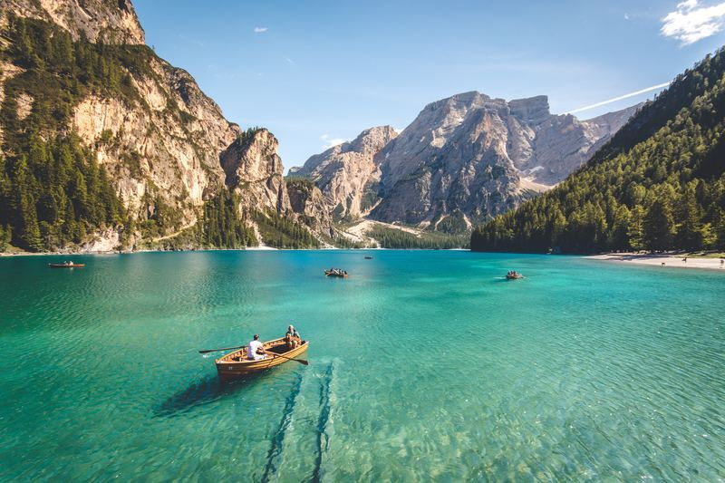
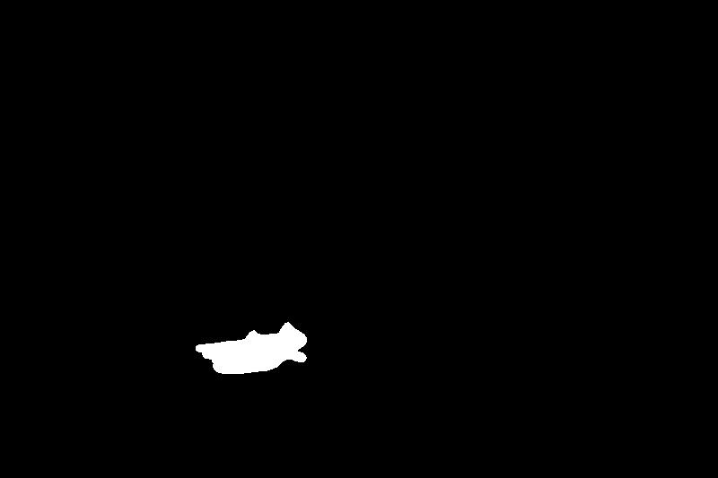
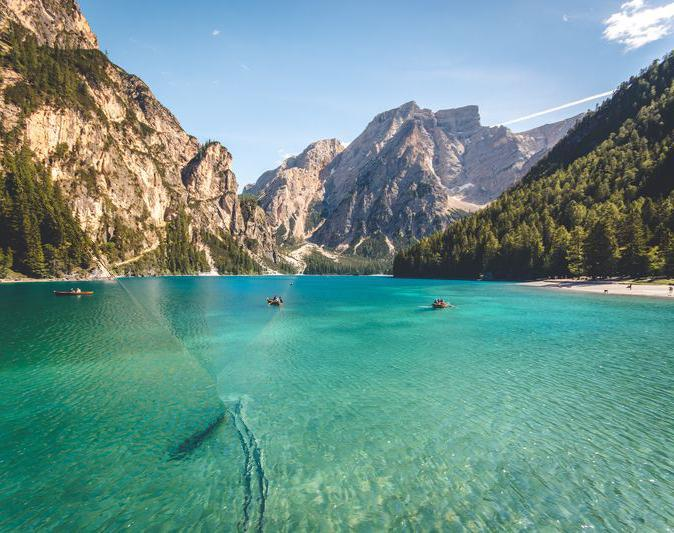

# Seam carving

### 算法原理

Seam Carving: 与PPT的完全一致，先通过图像的梯度信息得到图像的能量分布，然后动态规划找出能量最小的路径并删除。

具体在实现能量分布时，一开始使用二层嵌套，速度不是很好，之后使用numpy中的卷积函数进行了改进，速度与效果都得到了提升。

Object Removal: 基本方法与Seam Carving一致，只是需要调整能量分布，每次为需要剪除的区域设置一个极低的能量值，从而使需要剪除的区域总是优先被去除。

### 效果展示

##### 1.横向缩小

<center>

<br>原图
</center>


##### 2.长宽比调整

<center>

<br>原图
</center>

<center>

<br>调整后
</center>


##### 3.物体消除

<center>

<br>原图
</center>


<center>

<br>mask
</center>


<center>

<br>剪除后
<br>可以看出由于大海的颜色差异，还是可以看出不自然的现象
<br>但是远景的山就比较自然
</center>


### 不足

* 算法运行比较慢，在示例图像运行时切除一次（one seam）的时间大约1-2秒。

* 对于有规则几何图像的图片，算法可能会使这些几何信息丢失，还是有可以改进的地方的。

* 由于每次剪除seam上有连续性的要求，每次剪除的线会有斜率的限制，可以看到物体消除中的示例就因为斜率的限制不得不剪除了一些不改丢失的部分。


### 参考资料

1. https://zhuanlan.zhihu.com/p/38974520

2. Seam Carving for Content-Aware Image Resizing by Shai Avidan and Ariel Shamir

    

### 代码（附件seam_carving.py）

```python
from skimage import io
import numpy as np
from scipy.ndimage.filters import convolve


count = 1


def get_energy(img, r, c):
    # calculate energy(too slow)
    # energy = np.zeros((r, c)).astype(int)
    # for k in range(3):
    #     for i in range(r):
    #         for j in range(c):
    #             gy = img[i + 1, j, k] - img[i - 1, j, k]
    #             gx = img[i, j + 1, k] - img[i, j - 1, k]
    #             energy[i, j] += abs(gx)
    #             energy[i, j] += abs(gy)

    # use filter to accelerate
    fri = np.array([
        [1.0, 2.0, 1.0],
        [0.0, 0.0, 0.0],
        [-1.0, -2.0, -1.0],
    ])
    fci = np.array([
        [1.0, 0.0, -1.0],
        [2.0, 0.0, -2.0],
        [1.0, 0.0, -1.0],
    ])
    fr, fc = [], []
    for i in range(3):
        fr.append(fri)
        fc.append(fci)
    convolved = np.absolute(convolve(img, fc)) + np.absolute(convolve(img, fr))
    energy = convolved.sum(axis=2)
    return energy


 # DP back-track
def get_back(energy, r, c):
    back = np.zeros((r, c), dtype=int)
    for i in range(1, r):
        for j in range(c):
            if j == 0:
                index = np.argmin(energy[i - 1, j: j + 2])
                back[i, j] = j + index
                energy[i, j] += energy[i - 1, j + index]
            elif j == c - 1:
                index = np.argmin(energy[i - 1, j - 1: j + 1])
                back[i, j] = j - 1 + index
                energy[i, j] += energy[i - 1, j - 1 + index]
            else:
                index = np.argmin(energy[i - 1, j - 1: j + 2])
                back[i, j] = j - 1 + index
                energy[i, j] += energy[i - 1, j - 1 + index]
    return back


def carve_column(img):
    global count
    print('carve_column:', count)
    count += 1
    r = np.shape(img)[0]
    c = np.shape(img)[1]
    energy = get_energy(img, r, c)
    back = get_back(energy, r, c)
    j = np.argmin(energy[-1])
    delmask = np.ones((r, c), dtype=bool)
    for i in range(r):
        delmask[r - 1 - i, j] = False
        j = back[r - 1 - i, j]
    img = img[delmask].reshape((r, c - 1, 3))
    return img


def carve_column_obj(img, mask = None):
    r = np.shape(img)[0]
    c = np.shape(img)[1]
    energy = get_energy(img, r, c)
    # Object Removal: change energy map
    energy[np.where(mask > 0)] *= -1000.0
    back = get_back(energy, r, c)
    j = np.argmin(energy[-1])
    delmask = np.ones((r, c), dtype=bool)
    for i in range(r):
        delmask[r - 1 - i, j] = False
        j = back[r - 1 - i, j]
    img = img[delmask].reshape((r, c - 1, 3))
    mask = mask[delmask].reshape((r, c - 1))
    return img, mask


def aspect_ratio(img, newr, newc):
    img = np.copy(img).astype('float32')
    r = np.shape(img)[0]
    c = np.shape(img)[1]
    # 处理多剪除的方向
    delta = c - newc - r + newr
    num = 0
    if delta > 0:
        num = r - newr
        for i in range(delta):
            img = carve_column(img)
    else:
        num = c - newc
        img = img.transpose(1, 0, 2)
        for i in range(-delta):
            img = carve_column(img)
        img = img.transpose(1, 0, 2)
    # 交替剪除
    for i in range(num):
        img = carve_column(img)
        img = img.transpose(1, 0, 2)
        img = carve_column(img)
        img = img.transpose(1, 0, 2)
    return img


def object_removal(img, mask):
    img = img.astype('float32')
    while len(np.where(mask > 0)[0]) > 0:
        print('to bo removed:', len(np.where(mask > 0)[0]))
        img, mask = carve_column_obj(img, mask)
    return img


if __name__ == '__main__':
    # aspect ratio adjust
    # img = io.imread('./4.jpg')
    # r = np.shape(img)[0]
    # c = np.shape(img)[1]
    # newr = r
    # newc = c - 100
    # io.imsave('./aspect_ratio.jpg', aspect_ratio(img, newr, newc))

    # object removal
    img = io.imread('./4.jpg')
    mask = io.imread('./mask.jpg')
    io.imsave('./remove_object.jpg', object_removal(img, mask))

```

